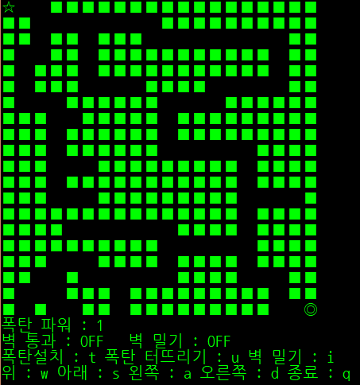

C, C++로 구현한 간단한 콘솔 게임
================================
제작자 :  [Kim Minsu](https://github.com/alstn2468)
--------------------------------
## Game 1 : 미로 찾기

### 스크린샷
- - -

### 조작법
- - -
위(↑) : `w`  
아래(↓) : `s`  
왼쪽(←) : `a`  
오른쪽(→) : `d`  
폭탄 설치(♨) : `t`  
폭탄 터뜨리기 : `u`  

시작 지점 : `★`  
출구 : `◎`  
플레이어 : `☆`  
폭탄 : `♨`  
길 : `□`  
벽 : `■`  

시작지점(`★`)에서 플레이어(`☆`)를 출구(`◎`)까지 보내면 된다. 
폭탄(`♨`) 사용 시 위, 아래, 왼쪽, 오른쪽 한 칸씩 길(`□`)로 만들어 준다. 
단, 폭탄(`♨`)은 최대 한번에 `5`개 까지 설치할 수 있다. 
- - -
